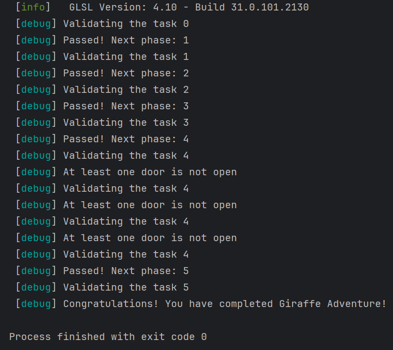
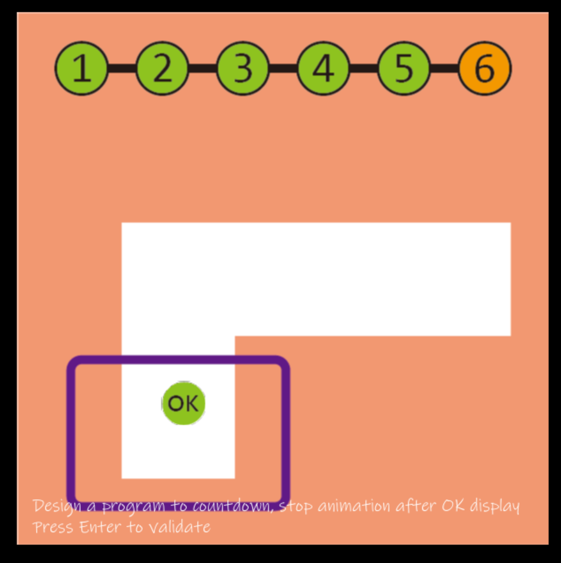
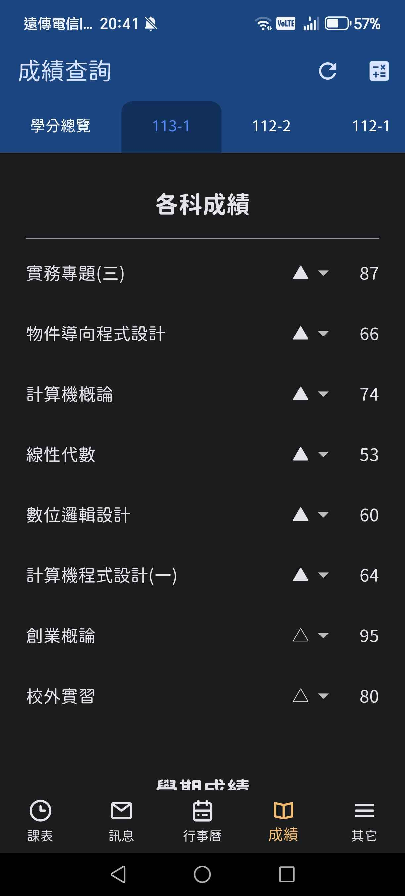
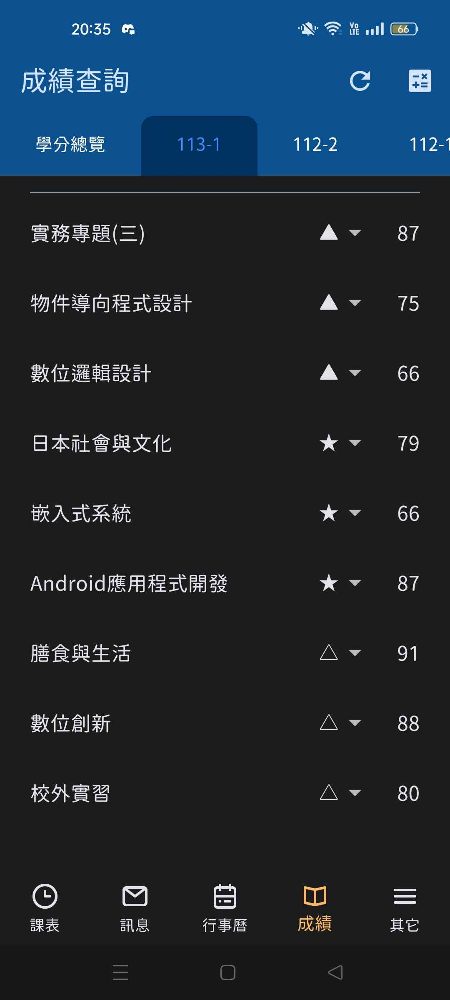

# Abstract

遊戲名稱：倉庫番（Sokoban）

組員：

- 110580041 陳士堯
- 110590062 陳世軒

# Game Introduction

推箱子（Sokoban）是一款經典的益智遊戲，玩家需要控制角色在倉庫內移動箱子，將其推到指定位置。遊戲的目標是透過最少的步數完成所有關卡，挑戰玩家的邏輯思維與空間規劃能力。

# Development timeline

- Week 1：準備素材
  - [ ] 蒐集遊戲的素材

- Week 2：準備素材
  - [ ] 蒐集遊戲的素材
  - [ ] 處理遊戲封面的素材
  - [ ] 進行遊戲封面的設計

- Week 3：角色基本移動
  - [ ] 讓角色可用鍵盤上下左右移動
  - [ ] 角色與牆壁碰撞偵測，避免穿牆

- Week 4：實作推箱子邏輯
  - [ ] 設計箱子的物理行為
  - [ ] 確保角色推動時，箱子能夠正確被推動
  - [ ] 角色一次只能推動一個箱子

- Week 5：地圖元素規劃
  - [ ] 定義基本的地圖物件(地板、牆壁、箱子、目的地)
  - [ ] 規劃遊戲中的障礙物與特殊機制(?)

- Week 6：關卡設計
  - [ ] 設計的關卡
  - [ ] 進行初步測試確保基本可玩性

- Week 7：地圖系統架構
  - [ ] 設計地圖的儲存方式

- Week 8：製作基礎關卡
  - [ ] 設計移動部署的限制

- Week 9：進階機制開發
  - [ ] 測試與調整關卡
  - [ ] 設計更多的關卡變數與機制

- Week 10：視覺與動畫調整
  - [ ] 改善角色的美術效果

- Week 11：細節調整與測試
  - [ ] 修正物理邏輯，如箱子卡住

- Week 12：關卡拓展
  - [ ] 接著製作剩下的關卡，確保有更多的挑戰性

- Week 13：整體優化
  - [ ] 測試關卡的難度，並作合理的部署調整
  - [ ] 修正 UI 顯示問題（數值變化、動畫效果）
  - [ ] 增加快捷鍵與遊戲設置（存檔、讀檔）

- Week 14：加入音效
  - [ ] 加入背景音樂與音效
  - [ ] 找朋友內測，收集玩家反饋

- Week 15：除錯與測試
  - [ ] 針對所有功能進行 Bug 修正
  - [ ] 優化最終版本

- Week 16：除錯與測試
  - [ ] 針對所有功能進行 Bug 修正

- Week 17：除錯與測試
  - [ ] 針對所有功能進行 Bug 修正
  - [ ] 優化最終版本

# 長頸鹿作業截圖
 
 

# OOP成績證明
 
 

# 影片
 [倉庫番](https://www.youtube.com/watch?v=dzlGmq_ef9U&list=PLQ34a77lUC6A64yzgi3HFjLWDBTEid258)