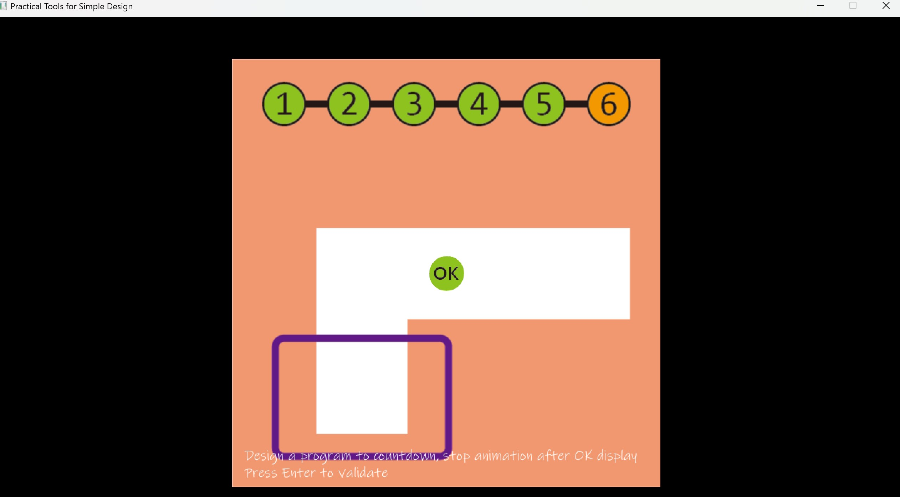

# Abstract

遊戲名稱：Fireboy & Watergirl

組員：

- b812110004 葉芸茜
- 112590450 李馥亘

# Game Introduction

《Fireboy & Watergirl》是一款雙人合作解謎冒險遊戲，玩家分別控制「Fireboy（火男孩）」與「Watergirl（冰女孩）」在各種關卡中合作，運用各自的屬性來通過障礙並抵達終點。遊戲場景中包含火焰、水池、機關、平台與各式謎題，玩家需要精準操作角色，運用合作技巧來解開關卡挑戰。

### 遊戲目標
- 關卡通關：玩家需要透過解謎和合作完成所有關卡。預計設計5個關卡，兩個角色皆須抵達目的地才算通關。
- 生存挑戰：如果角色掉入與自身屬性不符的液體（如火男孩掉入水池、冰女孩掉入熔岩）則會死亡，需要重新挑戰。
- 合作機制：玩家必須透過跳躍、推動物件、觸發機關等方式來互相幫助，才能成功過關。
- 機關特色：遊戲中包含按鈕、升降平台機關等，挑戰玩家的邏輯思考與操作技巧。

# Development timeline
- Week 1：準備素材
    - 蒐集遊戲的素材（角色、地圖、UI 設計等）

- Week 2：處理遊戲封面
    - 設計遊戲封面
    - 設計主選單
    - 建立關卡選擇畫面

- Week 3：設計關卡地圖
    - 設計5個關卡的基礎地圖
    - 設計關卡障礙物位置（熔岩、水池、機關）

- Week 4：角色基本操作
    - 角色移動機制（左右移動、跳躍）
    - 設定物理碰撞系統

- Week 5：優化遊戲畫面與角色動畫
    - 調整畫面解析度與 UI 佈局
    - 增加關卡背景與細節
    - 角色基礎動畫（站立、行走、跳躍）

- Week 6：增加機關與物件交互
    - 加入可互動的機關（按鈕、升降平台等）
    - 設計角色與機關的互動邏輯

- Week 7：角色特性與環境交互
    - 設定 Fireboy 無法碰水、Watergirl 無法碰熔岩的機制
    - 設定地圖邊界偵測，避免角色掉出場景

- Week 8：關卡目標與勝利判定
    - 設定雙角色皆須抵達終點才算過關
    - 增加計分機制或計時機制

- Week 9：期中考週
    - 進行整體測試與初步調整

- Week 10：音效與角色移動優化
    - 增加角色音效（移動、跳躍、機關觸發）
    - 角色移動與跳躍手感優化

- Week 11：物理碰撞優化
    - 進一步優化角色與物件的碰撞反應
    - 增加障礙物掉落與推動功能

- Week 12：光線反射機關
    - 新增光線反射機關，透過鏡子導引光線開啟門

- Week 13：平台與機關互動
    - 設計特定平台機制（如踩踏觸發、時間延遲）

- Week 14：關卡細節優化
    - 進一步優化關卡機關與互動
    - 優化遊戲效能，減少卡頓

- Week 15：多人合作測試
    - 確保雙角色能流暢合作（如協助攀爬、推動物件）

- Week 16：角色強化與道具
    - 增加角色強化能力（如短暫加速、雙跳）
    - 增加特殊道具（如時間暫停、減少水/火傷害）

- Week 17：最終測試與修正
    - 修復 BUG
    - 最後優化與關卡調整
    - 完成最終版遊戲

# Giraffe Adventure
